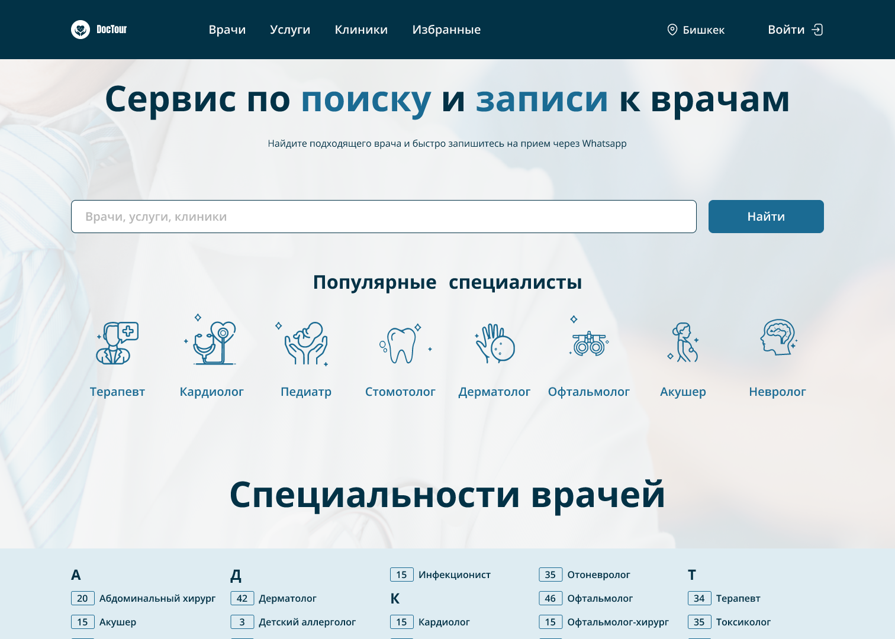

## Клонировать проект

    git clone https://gitlab.com/Bekbolsunn/doctour-api/

### |Быстрый старт

#### Скачайте docker перед этим https://www.docker.com/

    sudo docker-compose up --build

### |Вручную

#### 1) Создать venv и актиvироvать

    python -m venv venv

    🪟 Windows:
    cd venv/Scripts/activate

    🐧linux and 🍏 OS X:
    source venv/bin/activate

#### 3) Скачать зависимости

    pip install -r requirements.txt

#### 4) Создать и заполнить .env

    cp .env.example .env 

#### 5) Применить миграции и запустить проект

    python manage.py makemigrations && python manage.py migrate && python manage.py runserver

#### Или же проще sh run.sh

